# Run Android Front-End

## Steps
1. **Open Android Studio**.
2. **Open the project** located in the [`Android`](Android ) directory.
3. **Configure the server address**:  
    - identify your host machine ip address (`ipconfig` on windows\ `ip a` on linux)
    - modify `/Targil4/Android/app/src/main/res/xml/network_security_config.xml` to include your host IP
    - modify the field `BaseURL` under `/Targil4/Android/app/src/main/res/values/strings.xml` to have `http://{your-host-IP}:{API_PORT} instead of the default. 
4. **Build and run the project** on an emulator or physical device.  
### **make sure you're device is using the same network as the api server**

## Screenshots
1. Register new user:  
    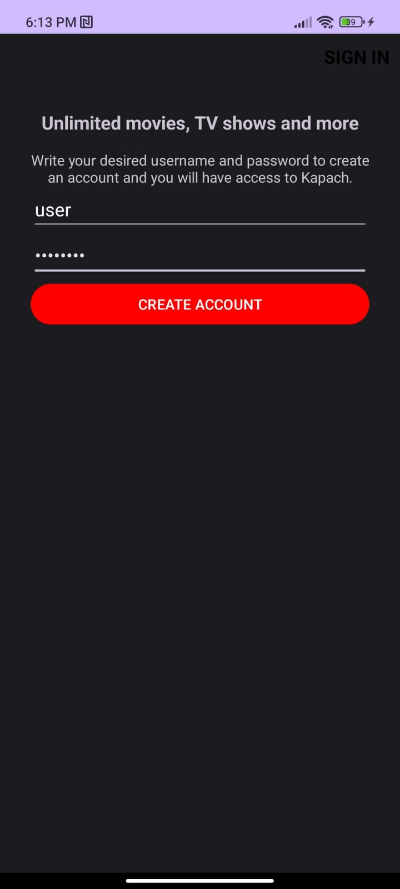
2. Login:  
    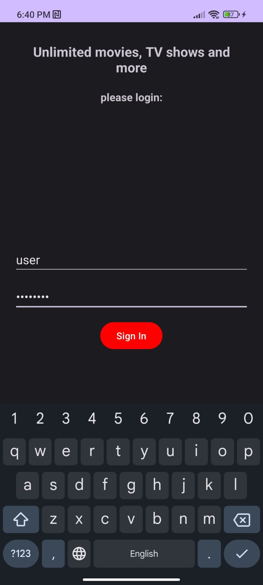
3. Home Page:  
    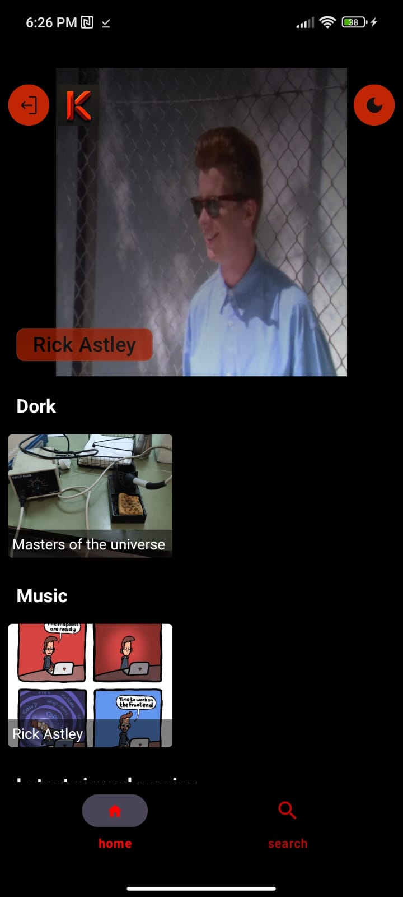
4. Movie Creation:  
    

        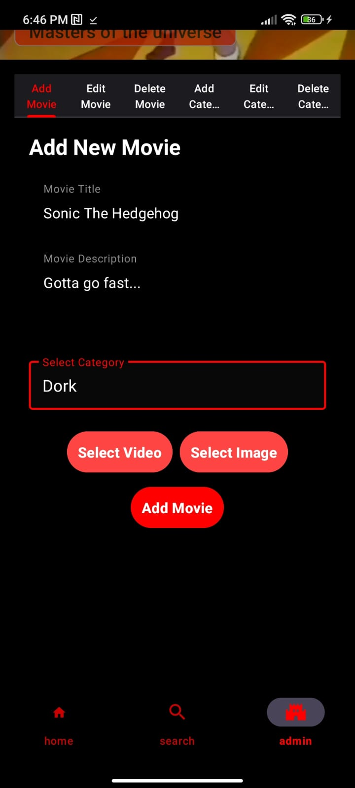
        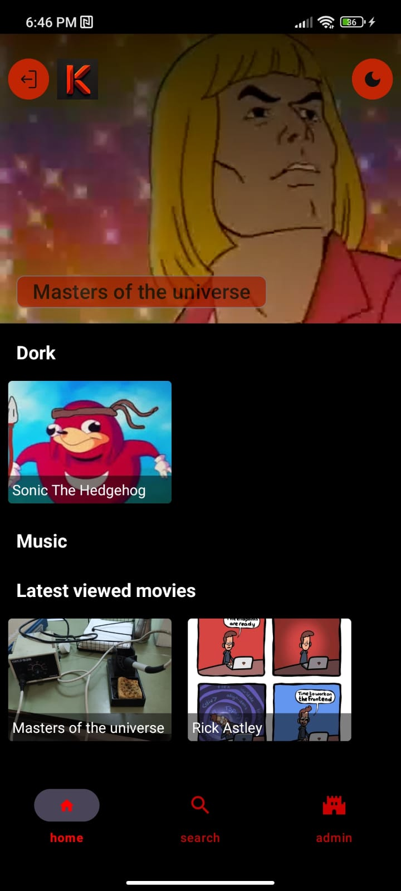
    

5. Movie Modification:  
    

        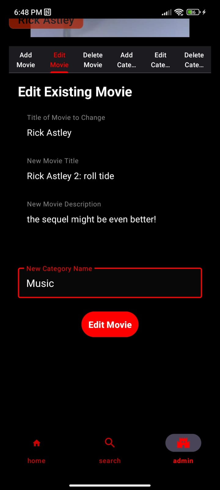
        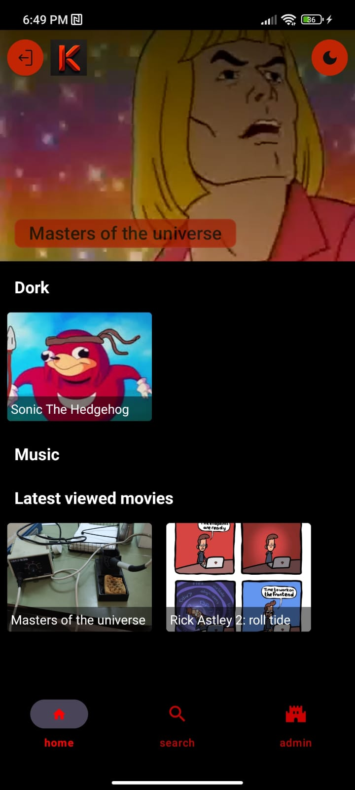
        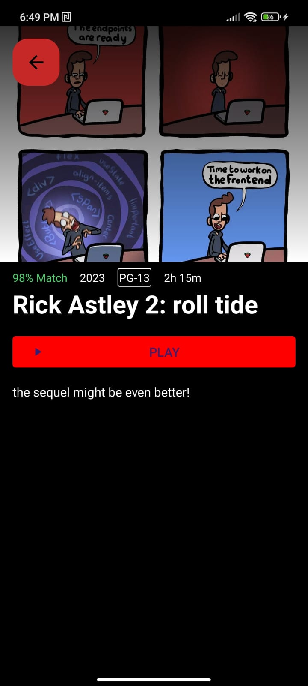
    

6. Movie Deletion:  
    

        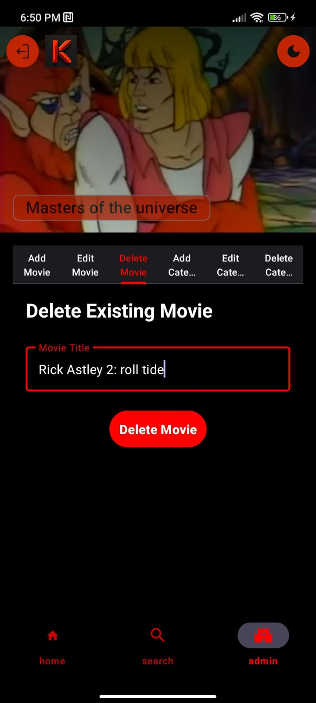
        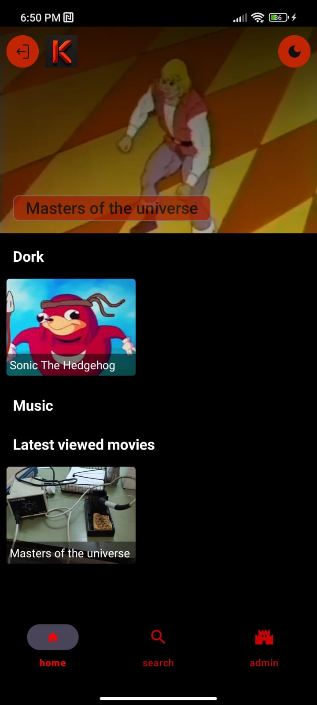
    

7. Movie watching:  
    

        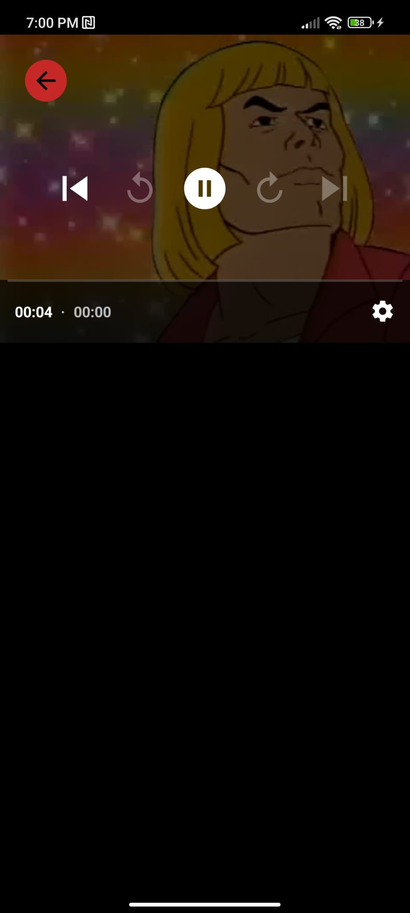
        
    

8. Movie Recommendation:  
    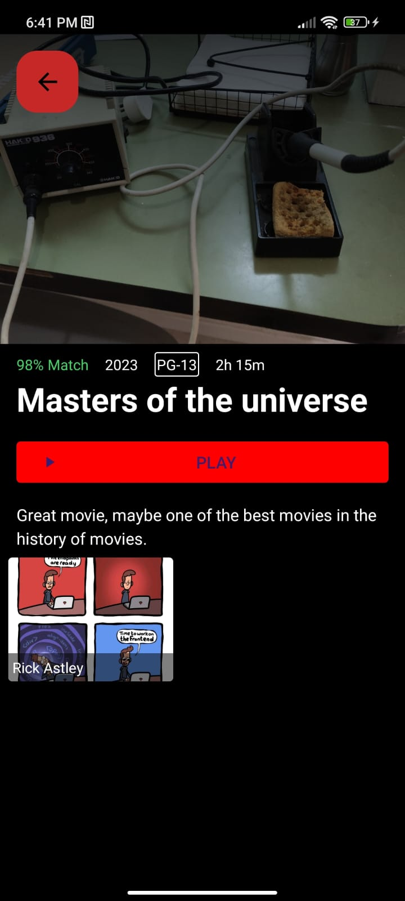
9. Movie Search:  
    

        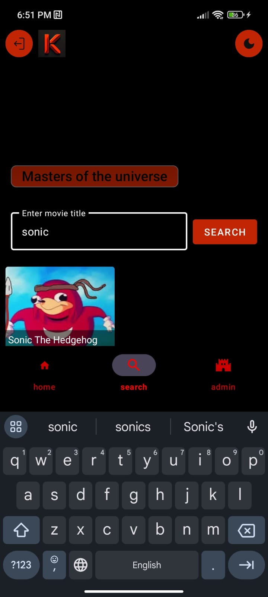
        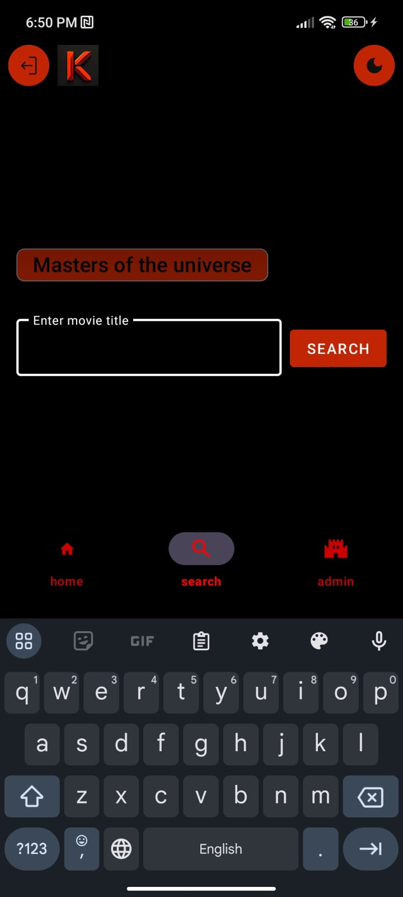
        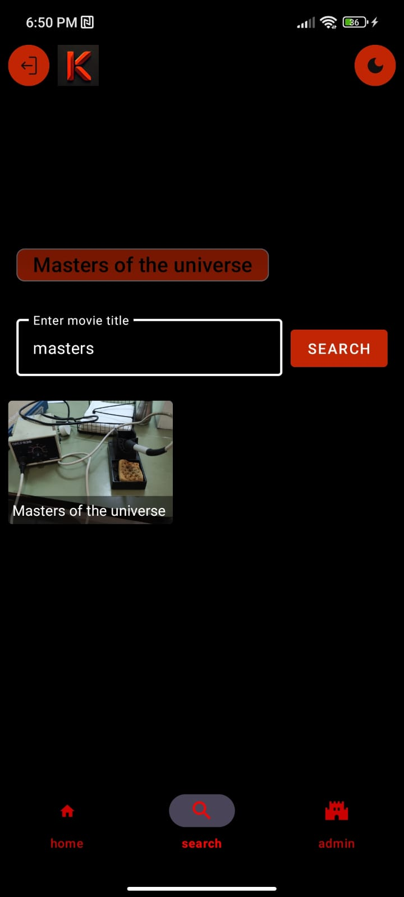
    

