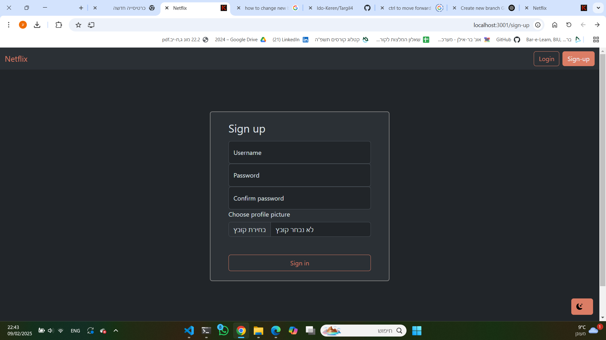

# Run Web Front-End

The web front-end is served from the Docker API server. It is built using React and can be accessed at `http://localhost:{API_PORT}`.

## Steps
Open the browser to
```
http://localhost:{API_PORT}
```

## Screenshots
1. Register new user:  
    
2. Login:  
    
3. Home Page For Logged Users:  
    
4. Categories Manage:  
    <div style="display: flex;">
        
    </div>
5. Movies Manage:  
    <div style="display: flex;">
        
        
        
    </div>
6. Movie-Info Page:  
    <div style="display: flex;">
        
    </div>
7. Movie-Player Page:  
    <div style="display: flex;">
        
    </div>
8. Search Page:  
    
9. Category Page:  
    <div style="display: flex;">
        
    </div>
10. Light Mode:
    <div style="display: flex;">
        
    </div>